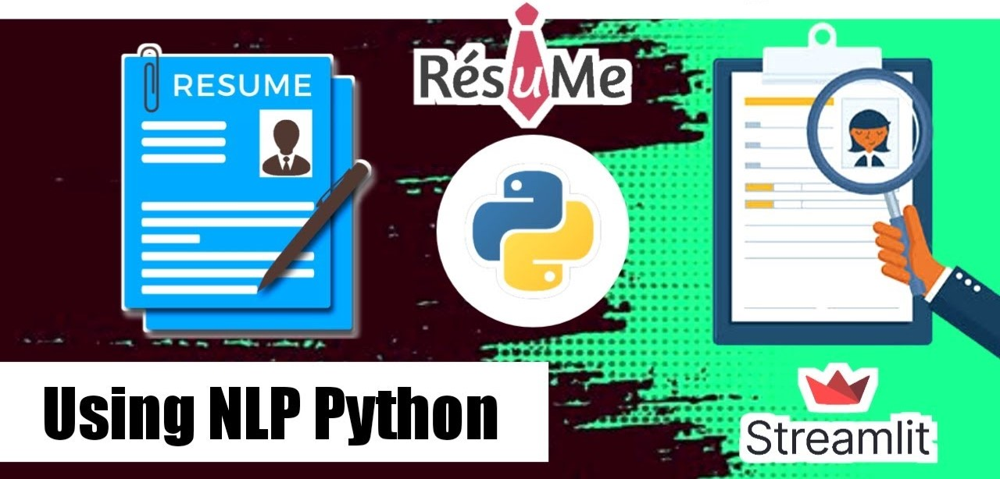

# 📄 Project — Resume Classifier

### `Business Objective:`

> The document classification solution should significantly reduce the manual human effort in HRM. It should achieve a higher level of accuracy and automation with minimal human intervention.



Resume classification is the task that automatically categorizes resumes/CVs into predefined domain categories based on their content. This is essential for the job recruitment process, particularly when organizations receive a large number of applications for various positions.


Resumes are an ideal example of unstructured data. Since there is no widely accepted resume layout, each resume may have its own style of formatting, different text blocks, and different category titles.

---

### `Text Cleaning:`


Text cleaning (also known as text preprocessing) involves transforming raw text into a clean, consistent format. It includes lowercasing, tokenization, stop word removal, punctuation removal, lemmatization/stemming, and removing special characters or numerical values.

---

### `NLP Pipeline:`


The NLP resume classification pipeline involves: data acquisition → preprocessing → tokenization → stop word removal → text normalization → TF-IDF feature extraction → model training → evaluation → deployment.

---

### `Model Accuracy:`


**Random Forest classifier** was selected for deployment based on highest accuracy among evaluated models.

---

### `Tech Stack:`

| Layer | Technology |
|---|---|
| Backend API | FastAPI |
| Supervised ML Model | Random Forest (scikit-learn) |
| Unsupervised ML Model | KMeans Clustering (scikit-learn) |
| Embeddings | SentenceTransformers (`all-MiniLM-L6-v2`) |
| NLP & Skills Extraction | NLTK, spaCy, TF-IDF Vectorizer |
| Model Serialization | Pickle (`.pkl`) |
| Frontend | Vanilla JS, HTML, CSS, Chart.js |
| Server | Uvicorn |
| Containerization | Docker |
| Deployment | Render / Railway |

---

### `Dual-ML Architecture:`

This project features a state-of-the-art **Dual-ML System**:
1. **Supervised Classification:** Uses a trained Random Forest model and TF-IDF vectors to predict the precise Job Category.
2. **Unsupervised Clustering:** Uses SentenceTransformers for high-dimensional semantic embeddings, clustered via KMeans (12 clusters) to group resumes by structural and semantic similarity.
3. **Advanced Skill Extraction:** Uses spaCy NER and keyword matching to identify detected skills, suggest missing skills, and generate a structural match score.

---

### `Project Structure:`

```
Resume_Analyzer/
├── Codes/                  # Jupyter notebooks (EDA, training)
├── Datasets/               # Training datasets
├── Deployment/
│   ├── static/             # Frontend HTML/CSS/JS files
│   ├── main.py             # FastAPI application
│   ├── retrain.py          # Model retraining script
│   ├── ModelRFC.pkl        # Trained Random Forest model
│   ├── VECTOR.pkl          # TF-IDF Vectorizer
│   ├── Requirements.txt    # Python dependencies
│   ├── Dockerfile          # Docker container config
│   └── Procfile            # For Render/Railway deployment
├── README.md
└── .gitignore
```

---

### `How to Run Locally:`

**1. Clone the repository**
```bash
git clone https://github.com/RAGHUPALNATI/Resume_Analyzer.git
cd Resume_Analyzer/Deployment
```

**2. Install dependencies**
```bash
pip install -r Requirements.txt
```

**3. Run the FastAPI server**
```bash
uvicorn main:app --reload
```

**4. Open in browser**
```
http://localhost:8000
```

---

### `Run with Docker:`

```bash
docker build -t resume-analyzer .
docker run -p 8000:8000 resume-analyzer
```

---

### `API Endpoints:`

| Method | Endpoint | Description |
|---|---|---|
| `GET` | `/` | Serves the frontend UI |
| `POST` | `/predict` | Accepts resume text, returns predicted category |

---

### `Deployment:`

This project is deployed using **FastAPI + Docker** and is ready for platforms like **Render** or **Railway**.

> Previously deployed using Streamlit — now refactored to FastAPI for better scalability and custom deployment support.

---

### `Author:`

**Raghu Varma Palnati**
- GitHub: [@RAGHUPALNATI](https://github.com/RAGHUPALNATI)
- LeetCode: [raghuvarmapalnati](https://leetcode.com/raghuvarmapalnati)
- Institution: Lovely Professional University — B.Tech CSE (AI & ML)
